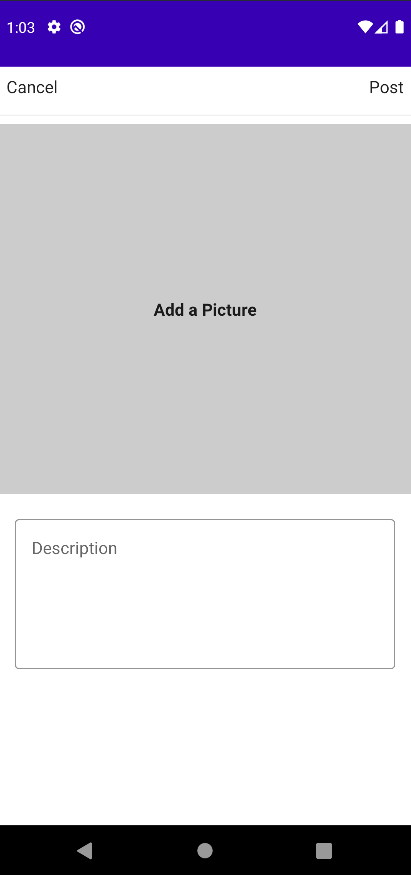
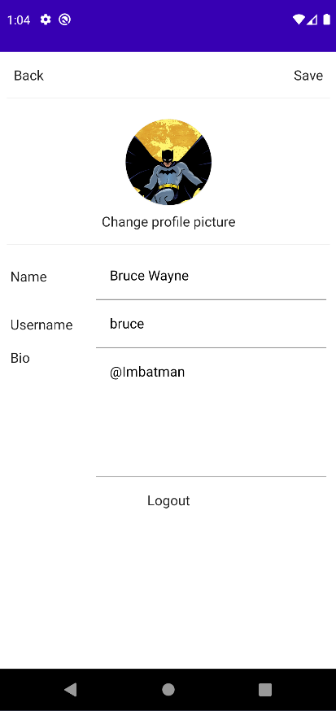

# Instagram Clone

This project is made to study concepts for Android Applications, using MVVM with Hilt to dependency injection, Jetpack Compose and Firebase.

## Authors

- [@lucasjacintho](https://github.com/lucasjacintho)

## 🚀 About Me
I'm a Data Engineer at this moment, so I'm in transition to an Android Developer role I'm doing these projects like a concept of studies.

## Acknowledgements

 - [Course Base](https://www.udemy.com/course/instagram_jetpack/)
 - [About Hilt](https://developer.android.com/codelabs/android-hilt)
 - [About Jetpack Compose](https://developer.android.com/jetpack/compose)

## Screenshots

